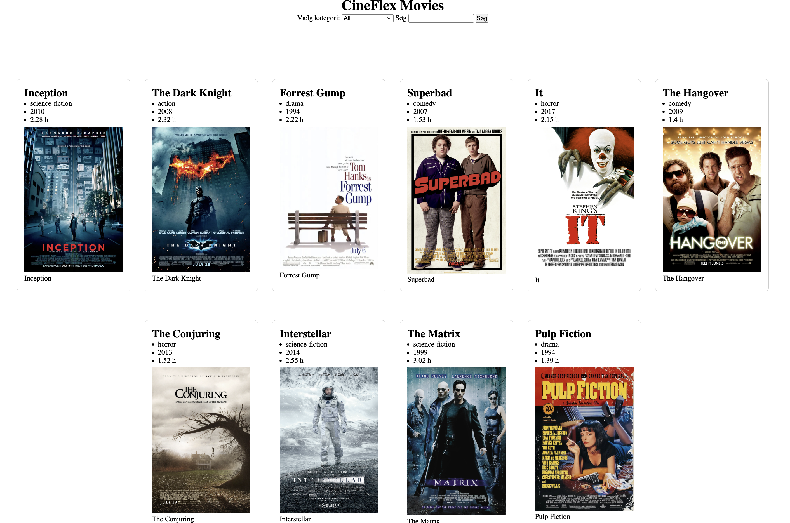

# 🎬 JavaScript DOM Data Rendering #4  
## Filtrering med dropdown, søgefelt og søgning i titel  
### CineMaxx Movies – Filter and Search

## Opgavebeskrivelse

Du skal bygge videre på din movie-side, så brugeren kan:

- vælge en kategori i en dropdown
- skrive en søgetekst i et søgefelt
- se filmene blive filtreret i DOM’en

I denne opgave skal du arbejde med:

- JavaScript-datastruktur (**array med objekter**)
- DOM-manipulation
- funktioner med parametre
- `map()`
- ` join("")`
- `filter()`
- `includes()`
- `querySelector()`
- `addEventListener()`

Du skal stadig bruge funktionen `displayMovies(movieList)` til at vise filmene på siden.

Det er vigtigt i denne opgave, at du forstår forskellen på:

- at **filtrere dat**
- og at **vise data i DOM’en**

Du skal altså **ikke** lave en ny visningsfunktion, bare fordi filmene skal filtreres.
Du skal først filtrere data og derefter sende de filtrerede film ind i `displayMovies()`.

Formålet med opgaven er at træne, om du kan:

- oprette en JavaScript-datastruktur ud fra `movies.txt`
- hente HTML-elementer med `querySelector()`
- genbruge en funktion med parameter
- filtrere et array med `filter()`
- bruge `includes()` til søgning i filmtitler
- arbejde med følgende events `change`, `input` og `submit`
- bruge `preventDefault()` på en form
- vise det filtrerede resultat i DOM’en

---

## Forudsætninger

Du må redigere i:

- `index.html`
- `js/movies-script.js`
- `css/style.css`

---

## Trin-for-trin

1. Download projektkoden (ZIP-fil) fra GitHub, og udpak den på din computer.

2. Opret et nyt repository på GitHub.com med et passende navn, fx:

`dom-filter-search-movies-exercise`

3. Kopiér linket til dit GitHub-repository.

4. Åbn GitHub Desktop og vælg **Clone repository**.

5. Vælg fanen **URL**, indsæt linket, og vælg en passende placering under **Local Path**.

6. Kopiér indholdet fra den udpakkede projektmappe over i den klonede mappe.

7. Åbn projektmappen i Visual Studio Code.

8. Løs nu opgaverne herunder.

---

## Projektmappe

Du får udleveret en projektmappe, som indeholder:

- en `index.html` fil
- en `css`-mappe
- en `js`-mappe
- en `img`-mappe med billeder
- en `movies.txt` fil med filmdata

Du får også udleveret HTML-strukturen til formularen og containeren til filmene. Filmdata skal hentes fra filen movies.txt, og du skal selv skrive dem ind i din JavaScript-datastruktur

---

### Opgave 1 – Link til CSS og JavaScript

I `index.html` skal du indsætte:

- et `<link>`-tag til `css/style.css`
- et `<script>`-tag til `js/movies-script.js`

CSS skal linkes i `<head>`, og JavaScript skal linkes lige før `</body>`.

---

### Opgave 2 – Tilføj Strict Mode

Åbn `js/movies-script.js`.

Tilføj denne linje som det allerførste i filen:

```javaScript
"use strict";
````

---

### Opgave 3 – Opret datastrukturen movies med de første 5 film

Åbn filen movies.txt.

I `js/movies-script.js` skal du nu:

- Opret en konstant variabel med navnet `movies`
- Få variablen `movies` til at pege på arrayet med objekter
- Brug oplysningerne fra **movies.txt**
- Vælg passende datatyper tol de forskellige properties
- Opret kun de første 5 film i arrayet

Hvert objekt skal have følgende properties:

- id
- title
- genre
- year
- duration
- img
- url

Du skal altså oprette de første 5 film i **movies.txt** og skrive dem ind i din JavaScript-datastruktur.

--- 

### Opgave 4 – Hent de HTML-elementer, du skal arbejde med

Du skal nu oprette fire konstante variabler, som peger på HTML-elementerne på siden.

Opret følgende variabler:

- `moviesContainer`
- `selectedCategory`
- `searchInput`
- `form`

Brug `document.querySelector()`.

De skal pege på:

- `#movies-container`
- `#category-select`
- `#gsearch`
- `form`

---

### Opgave 5 – Opret funktionen `displayMovies(movieList)`

Opret en funktion med navnet `displayMovies`.

Funktionen skal:

- have en parameter med navnet `movieList`
- modtage en liste med film
- vise filmene i DOM’en

Du skal genbruge denne funktion senere, også når filmene bliver filtreret.

---

### Opgave 6 – Brug `map()` og `join("")` i `displayMovies(movieList)`

Inde i funktionen displayMovies(movieList) skal du bruge:

- map()
- join("")

Start med at skrive denne struktur:

```JavaScript
const html = movieList.map((movie) => {
    return `
        Indsæt HTML-struktur her
    `;
}).join("");
```


---

### Opgave 7 – Byg HTML-strukturen til hver film

Inde i map() skal du returnere en HTML-struktur med template literals.

Brug denne struktur:

```HTML
return `indsæt HTML-struktur her`;
```

HTML-strukturen skal bygges op sådan her:

```HTML
<article>
    <h2>titel-placeholder</h2>
    <ul>
        <li>Genre: genre-placeholder</li>
        <li>År: year-placeholder</li>
        <li>Varighed: duration-placeholder</li>
    </ul>
    <figure>
        <a href="url-placeholder" target="_blank" rel="noopener noreferrer">
            
        </a>
        <figcaption>Læs mere på IMDB</figcaption>
    </figure>
</article>
```

---

### Opgave 8 – Erstat pladsholderne med data fra movie

Din opgave er at erstatte pladsholderne i HTML-strukturen med data fra JavaScript-datastrukturen ved hjælp af `${}`.

Du skal opdatere følgende elementer:
- titel
- genre
- år
- varighed
- url
- img
- alt-tekst som skal pege på titel

Det betyder for eksempel, at `titel` skal erstattes med `${movie.title}`, `genre` med `${movie.genre}` osv.

Du skal altså ikke selv finde på HTML-strukturen. Den er allerede bestemt.
Det, du skal gøre, er at indsætte de rigtige værdier fra hvert `movie`-objekt de rigtige steder i strukturen.

--- 

### Opgave 9 – Saml HTML-strengene med `join("")`

Når du bruger `map()`, får du et array med HTML-strenge.

Du skal samle dem til én samlet tekststreng ved at tilføje:

```JavaScript
.join("")
```

Den samlede struktur skal se således ud:

```JavaScript
const html = movieList.map((movie) => {
    return `
        Indsæt din HTML-struktur her
    `;
}).join("");
```

--- 

### Opgave 10 – Indsæt den færdige HTML i DOM’en

Når variablen `html` indeholder den samlede HTML-streng, skal du indsætte den i `moviesContainer` med `innerHTML`.

JS-koden skal se sådan ud: 

```JavaScript
moviesContainer.innerHTML = html;
```

Denne linje skal stå inde i funktionen `displayMovies(movieList)`, efter din `map(...).join("")` og før den afsluttende `}` til funktionen.

---

### Opgave 11 – Kald funktionen med filmdata

Nu skal du kalde funktionen `displayMovies()` og sende din JS-datastruktur med filmdata ind som et argument.

---

### Opgave 12 – Opret funktionen filterMovies()

Nu skal du oprette dagens vigtigste funktion: `filterMovies()`.

Funktionen skal bruges til at:

1. læse den valgte kategori fra dropdown
2. læse teksten fra søgefeltet
3. starte med alle film
4. filtrere filmene
5. vise resultatet i DOM’en

Opret funktionen med denne struktur:

```JavaScript
function filterMovies() {

}
```

---

### Opgave 13 – Hent værdien fra dropdown

Inde i `filterMovies()` skal du hente den valgte værdi fra dropdown-menuen og gemme den i en konstant variabel med navnet `selectedValue`.

```JavaScript
const selectedValue = selectedCategory.value;
```

--- 

### Opgave 14 – Hent teksten fra søgefeltet

Inde i `filterMovies()` skal du hente teksten fra søgefeltet og gemme den i en konstant variabel med navnet `searchTerm`.

Søgeteksten skal:

- laves om til små bogstaver med `toLowerCase()`
- renses for mellemrum før og efter med `trim()`

Brug denne struktur:

```JavaScript
const searchTerm = searchInput.value.toLowerCase().trim();
```

--- 

### Opgave 15 – Start med alle film

Inde i `filterMovies()` skal du oprette en omskiftelig variabel med navnet `filteredMovies`.

Den skal starte med at pege på hele arrayet `movies`.

---

### Opgave 16 – Filtrer på kategori

Nu skal du filtrere filmene ud fra den valgte kategori.

Du skal kun filtrere, hvis brugeren har valgt noget andet end "all".

Det betyder, at du skal bruge:

- `if`
- `filter()`

Brug denne struktur, men husk at du selv skal udfylde de steder som mangler:

```JavaScript
// Ret denne linje
Hvis (Valgte værdi (option) ikke er ligmed "alle") {
   // Ret IKKE denne linje
    filteredMovies = filteredMovies.filter((movie) => {
        // Ret denne linje, bortset ===
        returnere film.genre === Valgte værdi (option);
    });
}
```

---

### Opgave 17 – Filtrer på søgetekst i titel

Nu skal du filtrere videre på filmtitel.

Du skal kun filtrere, hvis søgefeltet ikke er tomt.

Brug:

- `if`
- `filter()`
- `toLowerCase()`
- `includes()`

Brug denne struktur, men husk at du selv skal udfylde de steder som mangler:

```JavaScript
// Ret denne linje
Hvis (søgefeltet ikke er ligmed en tom tekst-streng) {
    // Ret IKKE denne linje
    filteredMovies = filteredMovies.filter((movie) => {
        // Ret denne linje, bortset fra toLowerCase().includes
        returner film.titel.toLowerCase().includes(søgefeltet);
    });
}
```

Her undersøger `includes()`, om filmtitlen indeholder den tekst, brugeren har skrevet.

---

### Opgave 18 – Lyt efter ændringer i dropdown

Nu skal du få funktionen `filterMovies()` til at køre, når brugeren vælger en ny kategori i dropdown-menuen.

Brug `addEventListener()` med event-typen `"change"` på variablen `selectedCategory`.

---

### Opgave 19 – Lyt efter input i søgefeltet

Nu skal du få funktionen `filterMovies()` til at køre, mens brugeren skriver i søgefeltet.

Brug `addEventListener()` med event-typen `"input"` på variablen `searchInput`.

---

### Opgave 20 – Håndter formens submit

Når en formular bliver sendt, vil siden normalt reloade.

Det vil vi ikke have i denne opgave.

Du skal derfor tilføje en event listener på `form`, hvor du bruger:

- `"submit"`
- `event.preventDefault()`
- `filterMovies()`

Brug denne struktur:

```JavaScript
form.addEventListener("submit", (event) => {
    event.preventDefault();
    filterMovies();
});
```


---

### Opgave 21 – Grundlæggende CSS styling

Style siden i `css/style.css`.

Siden skal mindst have:

- en centreret overskrift
- luft omkring indholdet
- filmkort med kant eller baggrund
- ensartet afstand mellem elementer
- billeder i en passende størrelse

Du skal forsøge at style siden, så den minder så meget som muligt om referencebilledet, som vises efter opgave 22.

Du må gerne bruge følgende CSS properties:

- `margin`
- `padding`
- `border`
- `border-radius`
- `width`
- `height`
- `max-width`
- `background-color`

---

### Opgave 22 – Layout med CSS Flexbox

Brug CSS Flexbox til at lave layoutet til filmene.

Filmene skal vises som kort i rækker med luft imellem.

Du skal bruge Flexbox på #movies-container.

Her er nogle egenskaber, du kan arbejde med:

- `display: flex`
- `flex-wrap: wrap`
- `justify-content`
- `align-items`
- `gap`

Du skal forsøge at style siden, så den minder så meget som muligt om referencebilledet, som vises her.


---

### 📚 Ressourcer og hjælp
- W3Schools – JavaScript Arrays - https://www.w3schools.com/js/js_arrays.asp
- W3Schools – JavaScript Objects - https://www.w3schools.com/js/js_objects.asp
- W3Schools – JavaScript Functions - https://www.w3schools.com/js/js_functions.asp
- W3Schools – JavaScript map() - https://www.w3schools.com/jsref/jsref_map.asp
- W3Schools – JavaScript join() - https://www.w3schools.com/jsref/jsref_join.asp
- W3Schools – JavaScript HTML DOM - https://www.w3schools.com/js/js_htmldom.asp
- W3Schools – querySelector() - https://www.w3schools.com/jsref/met_document_queryselector.asp
- W3Schools – innerHTML - https://www.w3schools.com/jsref/prop_html_innerhtml.asp
- W3Schools – Template literals - https://www.w3schools.com/js/js_string_templates.asp
- W3Schools – CSS Flexbox - https://www.w3schools.com/css/css3_flexbox.asp

---

### 📤 Aflevering

Indsæt linket (URL) til dit GitHub-repository på Canvas.

Sørg for, at repository’et er public.

---

### ⏰ Afleveringsfrist

Torsdag d. 23. april 2026, kl. 23.59 på Canvas.